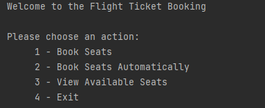
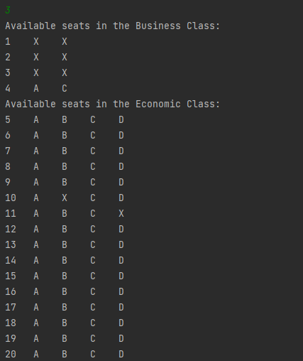
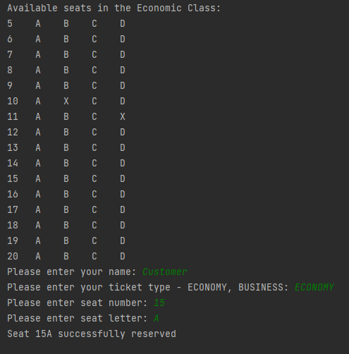

# Java Console Based Plane Seat Allocation System

Information has been stored using Files.

Application has following functions:
```
- book seats manually
- book seats automatically
- view available seats
```

Console output examples:




